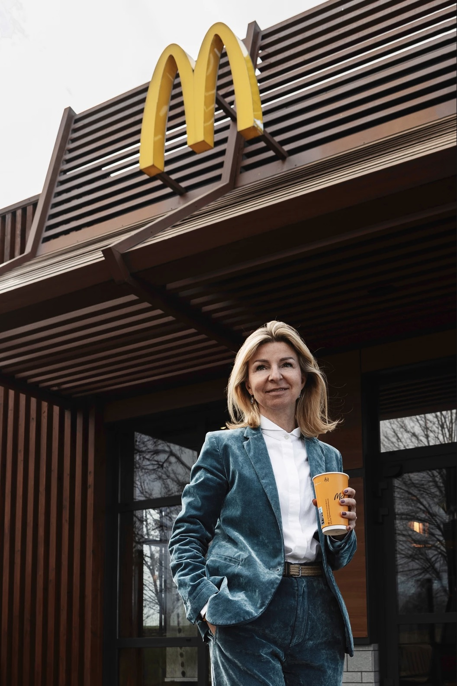

# First Impression

- [About](#about)
- [Featured Projects](#featured-projects)

## About

<!-- Consider including a headshot. We’re not designing, so keep the image width/height around 320px x 320px (square). Replace "surname" with your surname in the file name. -->

Hi, I'm Marek, a photographer who graduated from Michael Academy. I've been taking pictures for a while now, making cool portraits for Reporter magazine and teaming up with different companies to create portfolios for important people.

When I'm not behind the camera, you'll usually find me playing my electric guitar or enjoying some PlayStation games in my free time. I used to be really into sports, but as time goes on, I've grown to appreciate just chilling out with a good drink and taking it easy. I also like architecture and design, that's why I like going to exhibitions or reading books

In the winter, I love hitting the slopes for some skiing in the mountains. When summer rolls around, I trade in my skis for a motocross bike and rev up the excitement. It's all about finding a balance between the artistic side of photography and the adrenaline rush of outdoor adventures. 

## Skills
- I shoot with Canon
- I prefer Apple but I can also use Windows
- I know photoshop, Lightroom
- My friend has become Ai

## Featured Projects

I've chosen projects that I'm happy with and have moved me in the professional world to where I am now. I chose projects in the art world. Since I studied film from the beginning I share this stage of work as well.

### JOJO RABBIT

- A movie for the American production company Fox Searchlight Pictures
- I've done DIT and dailies work on the film.
- Released in 2019, this war comedy-drama film is a tour de force in storytelling, thanks to the brilliant mind of Taika Waititi, who not only directed but also penned the screenplay.
- In the realm of cinematic artistry, "Jojo Rabbit" occupies a unique space, blending elements of humor and poignancy against the backdrop of war. Taika Waititi's distinctive style permeates every frame, infusing the narrative with a rare combination of wit, charm, and thought-provoking themes.
- Having had the privilege of contributing to the film's production process, I immersed myself in the world of "Jojo Rabbit" through the roles of Digital Imaging Technician (DIT) and overseeing the creation of dailies. The intricacies of handling digital files, ensuring optimal image quality, and collaborating with the cinematography team allowed me to witness firsthand the meticulous craftsmanship that went into bringing this cinematic gem to life.

<!-- Use a static poster image or animated GIF, but no video files. Again, keep the image width/height manageable, around 1280x x 720px (16:9 aspect ratio), or a max-width of 1280px. -->

### Reporter Magazin

- I've been working with the magazine for over three years now and together we create photographs for the articles that the writers create. The photographs are published both in print and in online articles.
- I get to meet interesting people and create something that is printed every month and goes to the shops.
- Reporter, a Czech magazine launched in September 2014, has been my creative canvas for over three years. Collaborating with the talented writing team, I contribute photography that enhances the magazine's articles, reaching readers through both print and online platforms.

### McDonald's
- Photoshoot of the owner of Czech McDonald's
- The owner of Czech McDonald's liked my photos and asked me to take pictures for them. We became friends and started planning more projects together. The pictures I took were put in magazines as part of a campaign to show the people who run the company.
- The photoshoot went well, and we got to know each other better. The owner wanted to show that real people are behind the McDonald's brand. The pictures were printed in magazines so more people could see them.
- After that, we kept working together on new ideas. Our teamwork is more than just a job – we respect each other and want to do great things together. The photos we took started a conversation about being honest and real in business. The owner wanted customers to see a face behind the McDonald's logo and feel a connection.

