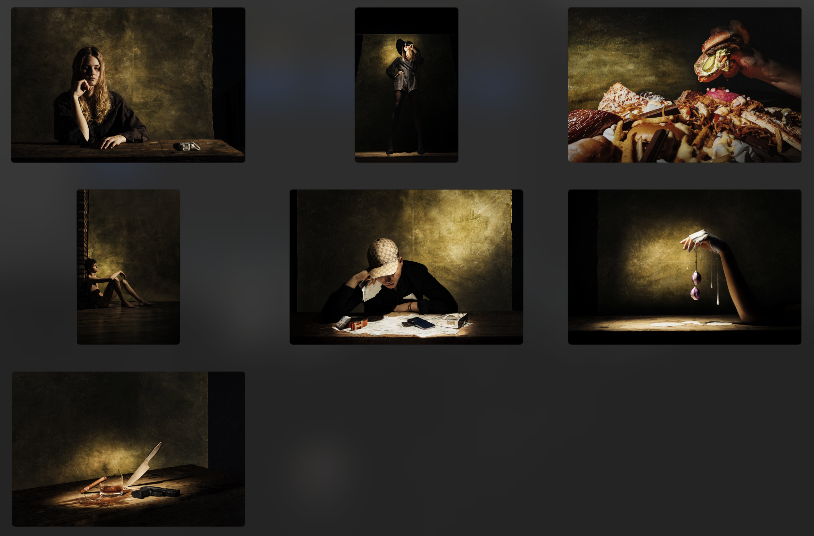

# Seven Deadly Sins

- [Listen me](/MP3/voice.m4a)

This is my work that I did last year. I had this set at the Prague Photo exhibition.
The primary focus of this storytelling is the depiction of the Seven Deadly Sins through both portrait and still life photography.

Photographers have often dealt with the theme of the seven sins, but only as part of a series of photographs and not as a whole that deals only with the seven deadly sins. Artists such as Roger Ballen, Terry Richardson, Bettina Rheims, Joel-Peter Witkin and many others have touched on individual sins and photographed their effects or the course of how they impact society.

## ENVY
The photo of Envy shows the state of a woman who does not wish for the success of another person, or the happiness she experiences through marriage or through material things that can create a feeling of happiness. The model view is clearly focused on jewelry and she is thinking about stealing. 
The photograph is shot using two lights. One light as the main light and the other as a supplementary light that illuminates the shadows so that even in the shadows there is detail in the photograph. The colors are edited in post production to achieve this look. The background is created by me using colours and different techniques that led to this result. Some of the details on the canvas are created in post production to create the desired atmosphere.

## WRATH
Wrath manifests itself as strong feelings of anger towards another person, but also towards oneself, and can lead to revenge. The photograph shows the possibilities of today's times to express anger and violence. The use of light was very similar in all the photographs and it was no different in this photograph. The background was and is used the same for all the photographs. Here the background was lit with another flash as I wanted to bring out the texture and drama of the canvas, as one flash would not achieve this effect.

## SLOTH
Sloth Sin captures the lack of faith in oneself and the lack of trying to improve anything and the total lack of interest in carrying out one's good intentions. Today's times are very close to this sin as young people often procrastinate on mobile devices on social media and are lazy to do any work. I used a young person for this sin to make it as clear as possible that young people are often involved in today's day and age. However, this is not always the rule.
One light was used here as the surrounding walls were white. Reflective shadows supplemented the light and therefore there was no need for an additional light source.

## GLUTTONY
It is about excessive consumption of drinks, food, but also to buy and collect things. It shows here that in this day and age of fast food and cheap food that can be bought anywhere, one can soon get into a state of obesity and very quickly realize this sin on oneself.
This still life is slightly different from the rest of the photos, but it is also this sin that differs the most from the others. A large amount of food, which may not be the best to look at, is the target of this photo.

## LUST
I have shown this sin in contrast to other still life photos I have photographed that are rougher. This sin is about intimacy, I did not try to create a photograph, such as with gluttony. At the same time, the intention was to make the photograph appear tender.
The light we used in this photo was one and this time I used a reflector to light some parts separately. I finished the photo in post-production, where it was cleaned of the dirt that was created during the droplet formation. I shifted the color spectrum slightly to make the photo look a bit more like the others.

## AVARICE
Avarice can also be called greed, it is a sin that indicates a person who is unwilling to share with others. In this sin I am pointing out the avarice of an individual who thinks only of himself and prides himself on having everything and has no regard for others. I didn't want the whole face to show. Avarice of myself and not sharing with others, that's why I didn't share the face of the model.
In the photo, I pointed to avarice as the accumulation of money and expensive accessories for one person's pleasure. 

## PRIDE
Pride is interpreted as a sin that desires attractiveness and over others. This sin was photographed with a woman because this sin is best able to materialize on a woman. Women often appear in this sin because of their popularity in dressing and showing superiority over other women. In this photo, I have shown how a woman shines and all the attention is on her alone. I used spot lights and using cinefoil to modify the light. It was taken from a low angle to give the impression that the model is above the viewer and has more power.

